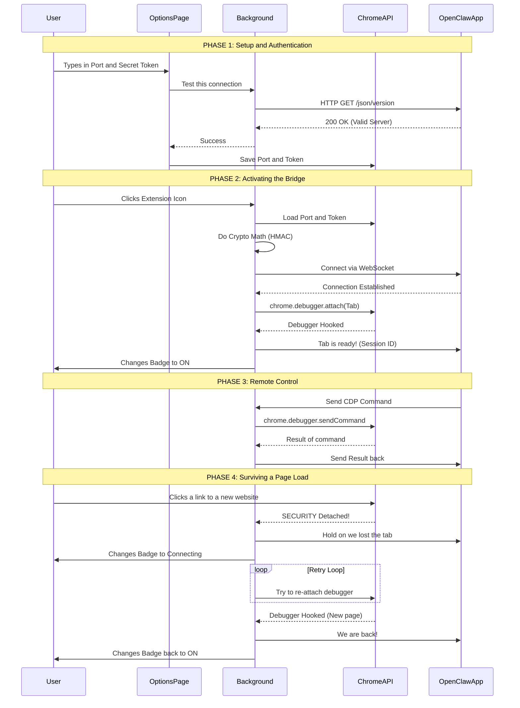

# OpenClaw Chrome Extension (Browser Relay)

Purpose: attach OpenClaw to an existing Chrome tab so the Gateway can automate it (via the local CDP relay server).

## Dev / load unpacked

1. Build/run OpenClaw Gateway with browser control enabled.
2. Ensure the relay server is reachable at `http://127.0.0.1:18792/` (default).
3. Install the extension to a stable path:

   ```bash
   openclaw browser extension install
   openclaw browser extension path
   ```

4. Chrome → `chrome://extensions` → enable “Developer mode”.
5. “Load unpacked” → select the path printed above.
6. Pin the extension. Click the icon on a tab to attach/detach.

## Options

- `Relay port`: defaults to `18792`.
- `Gateway token`: required. Set this to `gateway.auth.token` (or `OPENCLAW_GATEWAY_TOKEN`).

