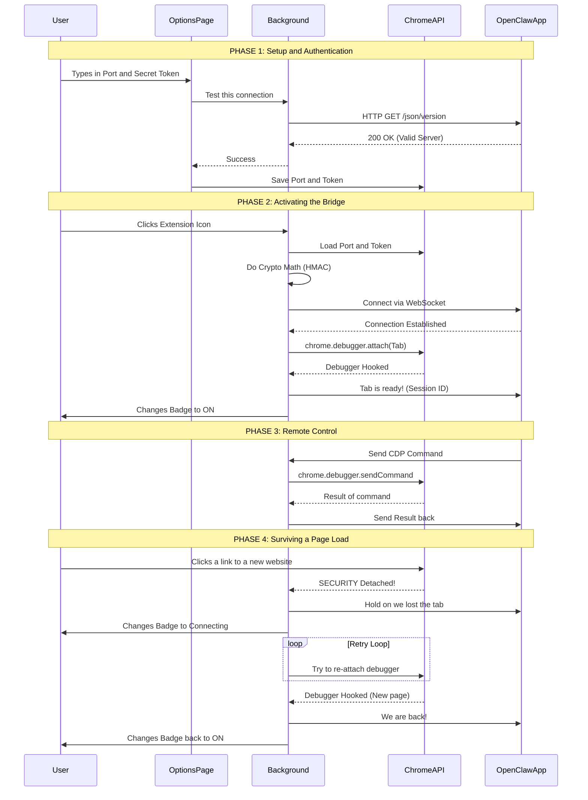

# OpenClaw Chrome Extension (Browser Relay)

Purpose: attach OpenClaw to an existing Chrome tab so the Gateway can automate it (via the local CDP relay server).

## Dev / load unpacked

1. Build/run OpenClaw Gateway with browser control enabled.
2. Ensure the relay server is reachable at `http://127.0.0.1:18792/` (default).
3. Install the extension to a stable path:

   ```bash
   openclaw browser extension install
   openclaw browser extension path
   ```

4. Chrome → `chrome://extensions` → enable “Developer mode”.
5. “Load unpacked” → select the path printed above.
6. Pin the extension. Click the icon on a tab to attach/detach.

## Options

- `Relay port`: defaults to `18792`.
- `Gateway token`: required. Set this to `gateway.auth.token` (or `OPENCLAW_GATEWAY_TOKEN`).


---

### Phase 1: Setup and Authentication (The Introduction)
**The Goal:** Connect your Chrome Extension to the OpenClaw desktop app so they trust each other.

Because the OpenClaw desktop app runs locally on your computer (at `127.0.0.1`), web browsers normally block websites and extensions from talking to it for security reasons. 
1. **The Action:** You open the extension's Options page and type in the Port number and your Secret Token. 
2. **The Verification:** When you click "Save", the Options page asks the Background script to silently "ping" the OpenClaw app. (The Background script is allowed to bypass Chrome's strict security blocks).
3. **The Result:** The OpenClaw app answers back, confirming it is running. The extension saves your Port and Token into Chrome's memory so it doesn't have to ask you again.

---

### Phase 2: Activating the Bridge (Hooking the Tab)
**The Goal:** Tell the extension to actually start controlling a specific webpage.

Even though the extension is configured, it doesn't just watch everything you do. You have to explicitly turn it on for a specific tab.
1. **The Action:** You go to a website (like Wikipedia or an app) and click the OpenClaw extension icon in your Chrome toolbar.
2. **The Connection:** The Background script reads your saved Token, does some heavy cryptographic math (HMAC) to secure it, and opens a live, two-way **WebSocket** connection to the OpenClaw app.
3. **The Hook:** The extension then fires the `chrome.debugger.attach` command. This hooks into the webpage just like when you press F12 to open Chrome's Developer Tools. 
4. **The Result:** The extension tells OpenClaw: *"I am hooked into this tab, send me your commands."* The extension icon turns **ON** (Orange) to let you know the tab is being watched/controlled.

---

### Phase 3: Remote Control (The Puppeteer)
**The Goal:** The OpenClaw desktop app (likely an AI agent or automation script) actively controls the browser.

This is the main loop where the actual work happens. The extension is now just a "dumb messenger" sitting between OpenClaw and Chrome.
1. **The Command:** OpenClaw decides it wants to do something (e.g., "Read the text on this page", "Scroll down", or "Click the login button"). It sends this command over the WebSocket.
2. **The Execution:** The Background script receives the message and translates it into a native `chrome.debugger.sendCommand`. Chrome physically executes the action on the webpage.
3. **The Result:** Chrome hands the data (like the HTML of the page, or a success confirmation) back to the Background script, which immediately passes it back to OpenClaw.

---

### Phase 4: Surviving a Page Load (The "Resilience" Hack)
**The Goal:** Keep the connection alive even if the user clicks a link that loads a completely new page.

This phase solves a massive headache in Chrome extension development. Chrome has a hardcoded security rule: **If a webpage navigates to a new URL, Chrome immediately kicks out any attached debuggers.** 
1. **The Disconnect:** You (or the automation script) click a link. Chrome violently detaches the extension. Normally, this would break the whole system, and you'd have to manually click the extension icon to start over.
2. **The Waiting Room:** Instead of panicking, the Background script catches this "detach" event. It tells OpenClaw *"Hold on, the page is loading, don't hang up!"* and changes the extension icon to "..." (Connecting).
3. **The Retry Loop:** The extension enters a rapid-fire loop, trying to re-attach to the tab (waiting 200ms, then 500ms, then 1 second...). 
4. **The Reconnection:** Once the new webpage has loaded enough to accept the debugger, the extension successfully hooks back in. It tells OpenClaw *"We are back!"*, changes the badge back to **ON**, and the automation continues seamlessly without you ever having to lift a finger.

5. 

